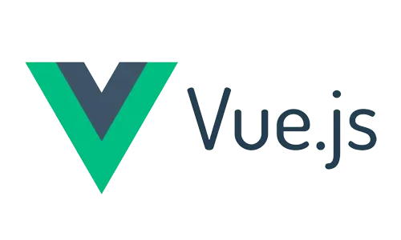

# Esse é um projeto de anotações pessoais!

## O backend do projeto foi "mockado" com json server

## O frontend do projeto foi criado com Vue 3!

### Vamos nessa? Siga os passos abaixo:
 1. Execute o backend primero.
 2. Depois execute o frontend.
 3. Teste no browser! Fim.